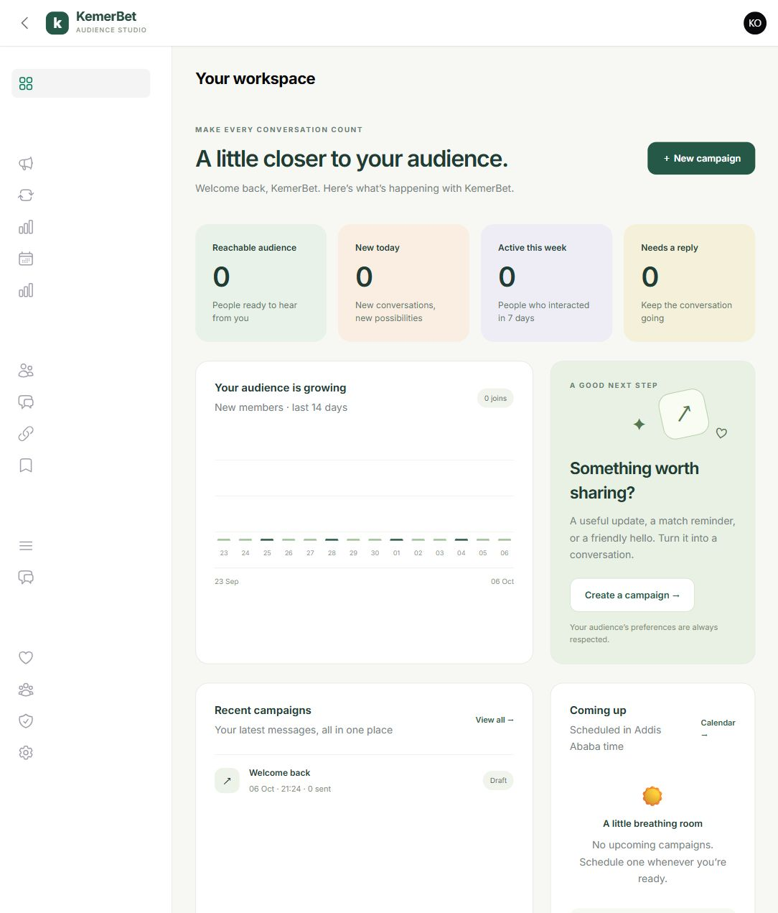

# Verification — 6 October 2026

The upgrade was verified on an isolated local installation, not against the live bot or production database.

| Check | Result |
|---|---|
| Full regression suite | 367 passed; 911 assertions |
| Final workspace and personal-reply checks | 34 passed; 117 assertions, including an additional administrator-removal check |
| PHP syntax | 273 application/configuration/migration/route files; zero syntax errors |
| PHP formatting | Laravel Pint passed |
| Composer definition and lock | Strict validation passed |
| PHP dependency advisories | None reported; no abandoned packages reported |
| Frontend dependency advisories | Zero reported vulnerabilities |
| Production frontend build | Vite build passed |
| Database setup | All four new migrations applied successfully to the local preview and test database |
| Browser | Owner login, dashboard, three-step campaign draft save, inbox, reports, delivery center, desktop and phone dashboard |
| Browser console | No errors recorded in the final QA tab |
| Original archive | Unmodified |

The final focused run covers the updated personal-message authorization checks after the full suite. Across both runs, 368 distinct tests were verified. Tests use fake Telegram exclusively, PostgreSQL on local port 5445, and an isolated Redis database on port 6381. PHP 8.4.26 and Node.js 24.14.1 were used. Source and dependencies are locked for reproducible installation.

The suite covers role permissions, bilingual content, schema constraints, durable recipient recovery, retry delays, stale-worker fencing, outcome/counter rollback, opt-out after preparation, topic choices, shared daily caps, quiet hours, approval thresholds, targeted retry edits, cohort assignment, poll ordering and Redis loss, authenticated conversion idempotency, media cleanup, MFA secret encryption, queue-dispatch loss, recovery quarantine, and personal-message administrator removal.

## Preview

[Phone preview](preview/backoffice-mobile.jpg)

## Deployment limits

A real webhook/token, shared production media storage, operating queue workers, scheduler, and business-event integration still need to be configured on the deployment. No production load test or real Telegram send was performed. External Telegram sends can still be ambiguous after a timeout; the database cannot provide an idempotency key that Telegram does not support.

Follow [the upgrade guide](UPGRADE-GUIDE.md), especially its existing-campaign and poll-history migration steps. Do not rebuild an old unfinished audience blindly.
